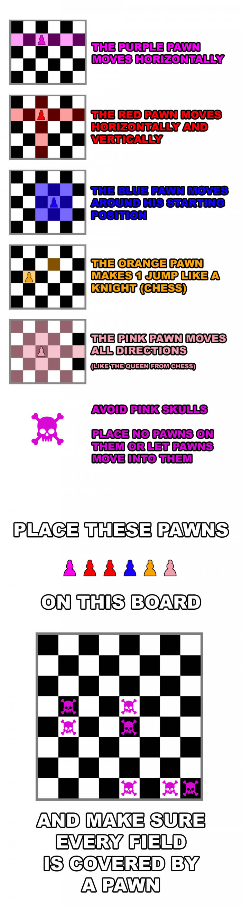
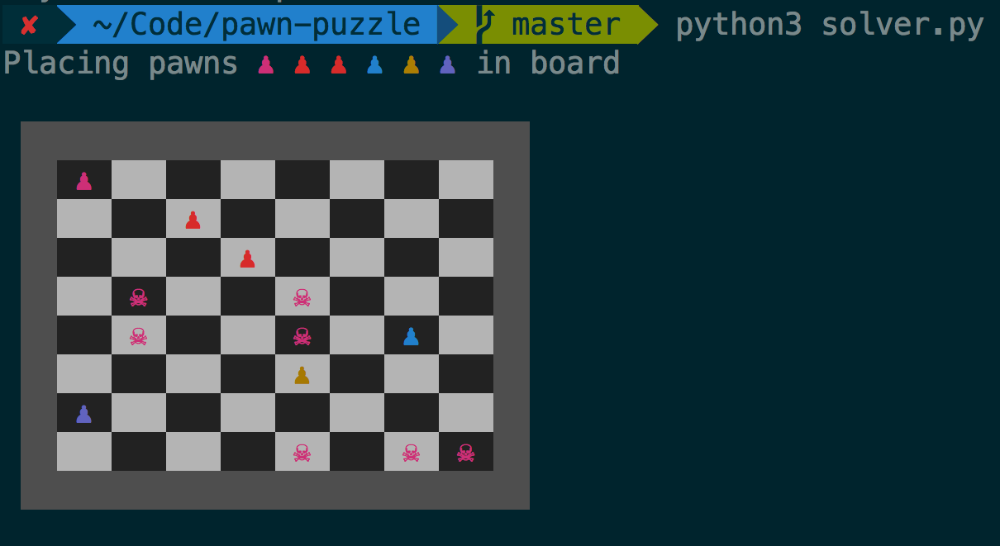

# Pawn puzzle

Python script that solves [the problem described in
9gag](http://9gag.com/gag/a8pNR03)

## The problem



## The solution

This program tries to find just the first solution to the proglem. It loops
through every position for every pawn, checking whether it's a valid position
to place the pawn according to the restrictions described above, and places the
pawns recursively. Finally, it checks wheter the coverage of the pawns is
complete, i.e., all the positions are controlled by a pawn.

It is possible to add more pawns, creating subclasses with different behaviors
and adding an instance to the initialization array. In the same way, the size
of the board or the skulls can be changed too.

The solutions is printed on the console in UTF using ANSII colors. This was
tested in an UNIX machine, but it may not work in windows (pull request? ;).

** SPOILER ALERT! **



## Improvements

The program takes about 30 seconds to find the solution, and it returns
inmediately after it has been found. It can continue looking for solutions (see
comments of solver.py) but it will take way too much time with the current
implementation. Feel free to improve the performance, making optimizations to
it or changing the algorithm to be more efficient.

## Use

To run the program you need python 2.7+ or python 3+.

```
$ python solver.py
```

To run the tests you need nosetests

```
$ nosetests
```

---

Here is a nerd potato:


